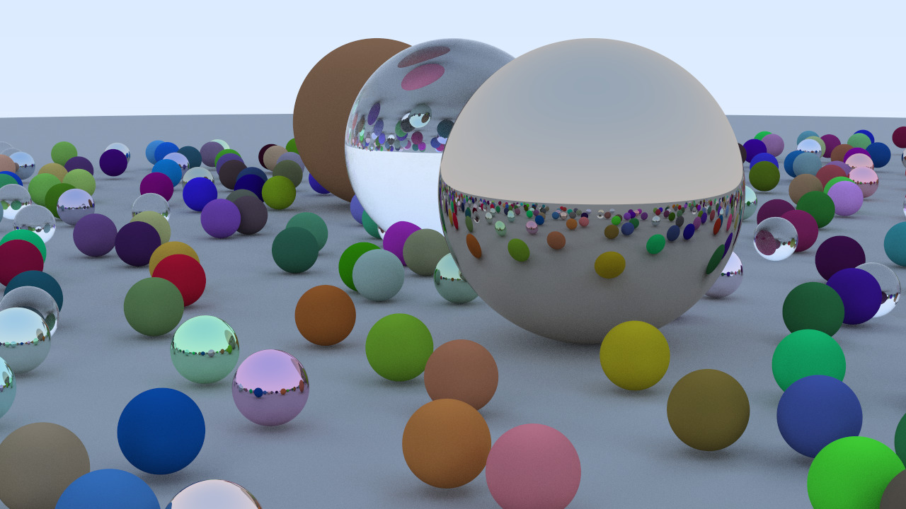

# pathtracing
path tracer

Written over a weekend to revise computer graphics principles and get more familiar with soft diffuse shadows and sampling strategies. This flavor is very popularly known as path tracing.

The final results are something like this

